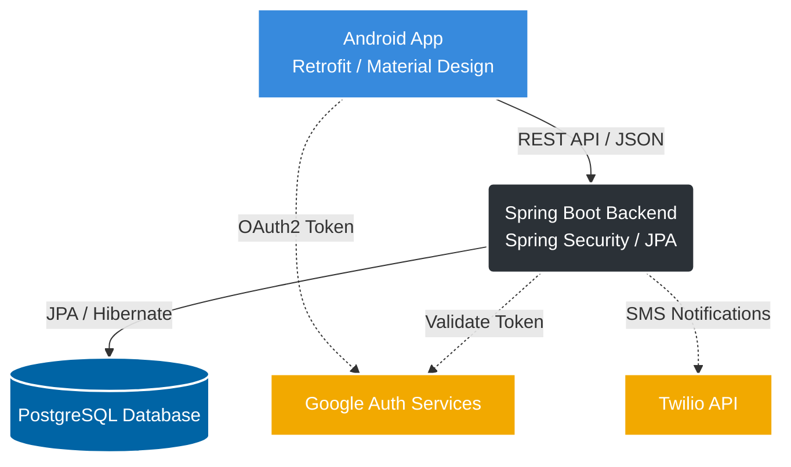

# 💳 WalletZen

<div align="center">
  <h3><strong>Your intelligent, secure, and beautiful Personal Finance Manager</strong></h3>
  <p>Built with Android (Java) and Spring Boot (Java 21)</p>
</div>

---

## 📖 Introduction
WalletZen is a comprehensive Personal Finance Management application designed to help users take control of their financial health. Combining a clean, Material Design-compliant Android interface with a robust and scalable Spring Boot backend, WalletZen provides seamless transaction tracking, budget management, and insightful statistical dashboards.

## ✨ Key Features
- **🔐 Secure Authentication:** Standard Email/Password login paired with seamless Google OAuth2 integration and Two-Factor Authentication via Twilio.
- **📊 Intuitive Dashboard:** Visualize your income and expenses with interactive charts (powered by MPAndroidChart).
- **💸 Transaction Management:** Easily log, edit, and delete daily transactions.
- **🎯 Budget Tracking:** Set monthly limits and monitor spending against specific categories.
- **📁 Category Management:** Organize transactions efficiently using dynamic, customizable categories.
- **☁️ Cloud Sync:** All data is reliably synchronized with our highly-available PostgreSQL database via a secure REST API.

## 🏛️ Overall Architecture

WalletZen employs a modern Client-Server Architecture, decoupling the mobile frontend from the backend services for enhanced scalability.



## 🚀 Installation

### Prerequisites
- **Frontend:** Android Studio (Ladybug or latest recommended), Android SDK 35, JDK 11+
- **Backend:** Java 21, Maven, PostgreSQL, Docker (optional)

### Clone the repository
```bash
git clone https://github.com/your-username/WalletZen.git
cd WalletZen
```

## ⚙️ Env Configuration

### Backend Setup
Create an `application-dev.properties` or `.env` in `personal-finance-backend-app/src/main/resources` (or inject via environment variables):

```properties
# Database Configuration
spring.datasource.url=jdbc:postgresql://localhost:5432/walletzen
spring.datasource.username=your_db_user
spring.datasource.password=your_db_password

# Google OAuth2
google.client.id=YOUR_GOOGLE_CLIENT_ID
google.client.secret=YOUR_GOOGLE_CLIENT_SECRET

# Twilio Configurations
twilio.account.sid=YOUR_TWILIO_SID
twilio.auth.token=YOUR_TWILIO_TOKEN
twilio.phone.number=YOUR_TWILIO_PHONE
```

### Frontend Setup
In `app/src/main/res/values/strings.xml` or via `local.properties`:
```properties
# Add your base API URL in local.properties
BASE_URL="http://10.0.2.2:8080/api/"
```

## 🏃 Running the Project

### 1. Start the Backend Server
```bash
cd personal-finance-backend-app
# Optional: Use Docker to spin up Postgres quickly
docker-compose up -d

# Run the Spring Boot application
./mvnw spring-boot:run
```
The server will start on `http://localhost:8080`.

### 2. Launch the Android App
- Open the project in **Android Studio**.
- Sync Gradle files.
- Select your Emulator or Physical Device and click **Run** (▶️).

## 📂 Folder Structure

```text
WalletZen/
├── app/                              # Android Frontend Codebase
│   ├── build.gradle.kts              # Android build configuration
│   └── src/main/
│       ├── java/com/.../walletzen    # Activities, Adapters, Fragments, API Services
│       └── res/                      # XML Layouts, Drawables, Values, Themes
├── personal-finance-backend-app/     # Spring Boot Backend Codebase
│   ├── pom.xml                       # Maven dependencies
│   ├── docker-compose.yml            # PostgreSQL Docker configuration
│   └── src/main/java/com/finance     # Controllers, Services, Repositories, Models
└── README.md                         # Project documentation
```

## 🤝 Contribution Guidelines
We welcome contributions to WalletZen! To contribute:
1. Fork the repository.
2. Create a new branch (`git checkout -b feature/AmazingFeature`).
3. Commit your changes (`git commit -m 'Add some AmazingFeature'`).
4. Push to the branch (`git push origin feature/AmazingFeature`).
5. Open a Pull Request.

Please ensure your code adheres to standard Java conventions and passes existing tests.

## 📄 License
This project is licensed under the MIT License - see the [LICENSE](LICENSE) file for details.

## 🗺️ Roadmap
- [x] Initial UI Mockups & Architecture Design
- [x] Spring Boot REST API Core implementation
- [x] JWT & Google OAuth2 Authentication integration
- [x] Core Android Features (Transactions, Budgets, Categories)
- [ ] Push Notifications via Firebase Cloud Messaging (FCM)
- [ ] Multi-currency support
- [ ] Export reports to PDF/Excel
